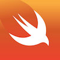

# Introduction to iOS and Swift

HackYale Swift Workshops, Spring 2015

## Welcome!

This repo is for students attending HackYale's Introduction to iOS and Swift workshop. The goal of this workshop
is to provide people with a basic interest in iOS development with the know how of what it takes to build an iOS
app and submit an application to the App Store.

## Downloads

- [Xcode 6](https://itunes.apple.com/us/app/xcode/id497799835?mt=12&uo=4)
- [The Swift Programming Language - iBook](https://itunes.apple.com/us/book/swift-programming-language/id881256329?mt=11&uo=4)
- [Dash](https://newyork.kapeli.com/Dash.zip) (Download link)
